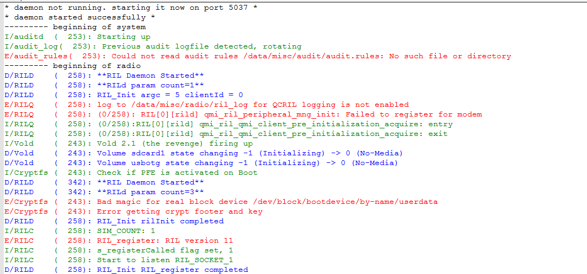

#LOFteam
复制(Copy)AndroidLogger.dll Config 文件夹到 Notepad++\plugins 目录下，重启Notepad++
* Android日志的高亮显示，可自定义颜色、自定义关键字
* 实时获取App日志、Radio日志
* 执行shell命令
* 抓取手机图片。
截图展示

参考文献：http://sourceforge.net/p/androidlogger/